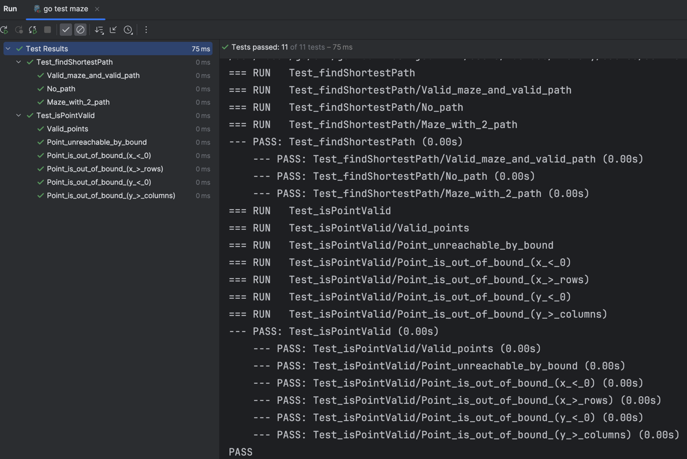

# Тестовое задание "Лабиринт"

## Содержание
- [Задание](#задание)
- [Реализация](#реализация)
    - [Результаты тестов](#результаты-тестов)

___
## Задание
Написать код для поиска в лабиринте самого быстрого пути из одной точки в другую.
Формат входных/выходных данных: текстовый через консоль
 

___
## Реализация:
Для решения задачи поиска пути был выбран алгоритм Дейкстры с использованием двоичной кучи в качестве очереди.
Для ввода и вывода данных используется буферезированный *scanner* и *writer*, ошибки записываются в *STDERR*.
Используются валидации с добавлением новых ошибок на: 
- входные данные (неправильные размеры лабиринта)
- выбор точки (точка за границами лабиринта/на точке находится стена)
- поиск пути (его отсутствие)

Написаны [тесты](main_test.go) для проверки работы программы: 
- Функция валидации ячейки лабиринта
- Функции поиска пути
___

### Результаты тестов

